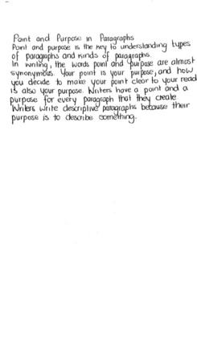

# Blog: Handwriting to Text Converter

**Conor Hanlon**

## Blog 1: My Idea

#### 18/10/18

Following a lengthy thought process and many different notions, I have finally settled on an idea for my final year project. I am going to design a web application aimed at college students. The app will let them upload images of their handwritten notes, and will generate a text document with the converted content. They will then have the options to save the document to their Google Drive or to download the file locally.

This project would be a useful platform for many students who have to write a lot of essays for as a part of their course. Also, it will help me learn a lot about new technologies such as neural networks through Tensorflow and image processing through OpenCV. Mr Ray Walshe has agreed to be my supervisor. The next step is to finish off my project proposal and present it to the panel.

## Blog 2: The Project Proposal

#### 24/10/18

Yesterday, I presented my idea to Charles Daly and Tomás Ward. My project was approved, which is a great first milestone to get on the board. They both agreed that while it would be an impressive application to implement, there is a significant risk involved with the training of the neural network. The main point of information I took away from the meeting is that I should ensure I have a contingency plan in place in the event of the trained model not being accurate.

This morning I met with Ray to discuss how the meeting went. After discussing my project with the lecturers, he kindly linked me to the Microsoft Azure API. They provide a cognitive service which carries out handwriting to text conversion. This will serve as my backup for the neural netowrk, to ensure I have an application to demo come May.

## Blog 3: Functional Specification

#### 23/11/18

I just completed my first draft of the fuctional specification. It took quite a lot of time to finish, but I am confident that my attention to detail in the early planning stages of the project will benefit me later in the year. I settled on EmberJS as my frontend framework and Flask as my REST API. Other technologies include OpenCV, Tensorflow, Docker, Bootstrap and various Google APIs.

## Blog 4: Last Meeting before Christmas

#### 27/11/18

This morning I met with Ray for the last time before the Christmas break. We discussed my progress so far and his expectations of me going into next semester. He acknowledged that a lot of my time will be spent studying for exams, but advised me to flesh out my web application as soon as possible. He suggesed that I investigate further into the neural network model, to ensure I hit the ground running next year. I hope to have my basic frontend and Google login implmented before we meet again.

## Blog 5: Google Authentication

#### 01/02/19

My main focus this week has been setting up the Google login functionality for the EmberJS application. Due to the fact that I am not storing any user information in a server-side database, the login will use a single sign-on and store any user information for the session in a cookie. I used the EmberJS module `ember-simple-auth` to help with the routing. The user is initially redirected to the `login` route if they have not signed in. After the user has been successfully authenticated, they are redirected to the `home` page. EmberJS is very useful for building single-page applications like mine, and my next focus will be developing the different components for uploading images.

## Blog 6: First Meeting of Semester 2

#### 08/02/19

I'm just back from my meeting with Ray. I showed him my current user interface and Google login functionality, as well as successful POSTing of uploaded images to my Flask API. I explained that my main aim is to have the bulk of the image processing functionality completed by the end of next week, so that I can focus on iplmenting the neural network. He is slightly concerned that I should be more conscious of time, because there will be a lot of trial and error involved in the training of the model. However, he thinks that if I can stick to the timelines laid out for myself and hit the milestones I am aiming for, I should be well on track to develop a well rounded application. The coming few weeks will be very demanding, but all the hours I put in will pay off in the end.

## Blog 7: Tackling Image Processing

#### 12/02/19

Over the last few days, I've been focusing on the image processing functionality of my Flask API. This is a core feature of my project, as it is central to the user application. I've been reading the OpenCV docs, a library providing computer vision tools, to gain a full understanding of how I should implement this component. One of the main issues I found was dealing with shadows in images. Below is an example of how my system was initially trying to process the images:

*Shadow*

To solve this issue, I had to dilate the different planes in the image. I then merged the results, which successfully removes the shadow. Here is an example:

*After*

## Blog 8: Test Driven Development

#### 14/02/19

A large component of any software application is testing the system to ensure it is robust as possible. It is important to ensure the code is designed to pass all test cases continually throughout the development lifecycle.

Today I configured my Gitlab Continuous Integration pipeline. This pipeline runs every time I push changes to my online repository. Currently, it runs all EmberJS unit tests to ensure that all test cases pass with the new changes in place. I plan to add Flask unit tests, as well as integration and acceptance tests between all the different components of my application. This will help ensure that my application is of the highest standard for my final presentation in May.

## Blog 9: Trial and Error

#### 07/03/19

My main focus for the past few weeks has been the core component of my project: the handwriting recognition model. A lot of research has gone into designing the model, and I understand that this will be a long process of trial and error to achieve as high an accuracy as possible.

My initial design had 5 convolutional layers to extract key features from the images of lines of text. This was followed by 2 recurrent layers to generate the output matrix, and finally a CTC decoder to return the predictions. The Long Short-Term Memory approach with the RNN and CTC components is a common decoding mechanism for text, which is why I chose to apply it. I'm using the IAM dataset, which consists of over 13,000 images of lines of text. In my data preprocessor, I am resizing the images to a scaled 800x64 shape for use in my model.

When I initially attempted to train the model with these configurations, the process finished with an accuracy of roughly 54%. Obviously, this is not sufficient, so I tried different techniques to improve this. I added 2 more convolutional layers to the model, as well as augmenting my dataset by applying random stretches to the training images.

Unfortunately, these changes only helped me achieve an accuracy of 68%, which is the position I am currently in. I'm coming up with possible solutions for my low accuracy:

-  Further augment my images, or look for another similar dataset.
-  Train a model to identify individual words instead of full lines of text. The IAM dataset contains 136,000 images in this category, making this a viable option.
-  Apply transfer learning to my neural network model. This is the reuse of publicly available models to train networks with comparatively small data. It involves importing the model, and redesigning the top 1 or 2 layers to fit my needs. This is the option I am leaning towards, as it can result in accuracies in the high nineties.

I plan to carry out more research into what solution is best, and hopefully my model will be of significantly better quality soon.
